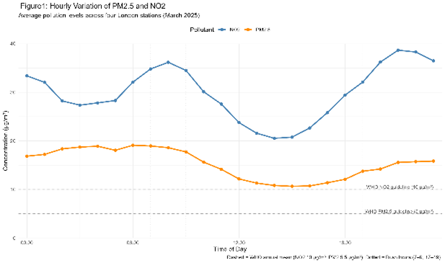
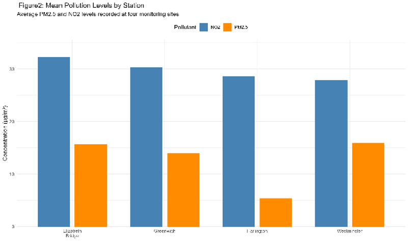
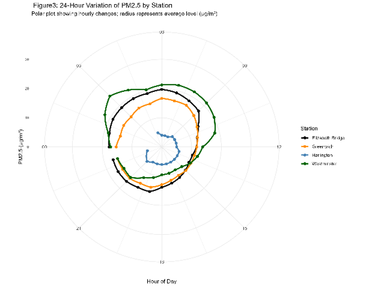
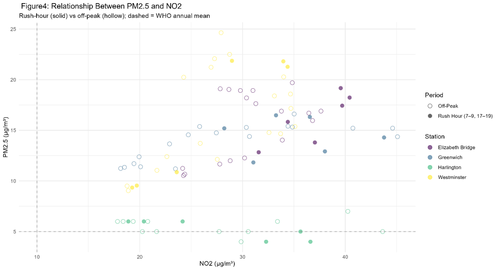

# London Air Quality Analysis

An exploratory analysis of air pollution in London, examining PM2.5 and NO₂ concentrations across four monitoring stations to show how temporal patterns, station-level differences, and pollutant relationships can be communicated through data visualisation.

Originally developed as a Data Visualisation project during my MSc in Data Science at the University of Sheffield.

**Built with R** — ggplot2, patchwork.

## Data

- **Source:** [OpenAQ](https://openaq.org/) (retrieved via API)
- **Pollutants:** PM2.5 and NO₂ (hourly measurements, March 2025)
- **Stations:**
  - Greenwich (Westhorne Avenue)
  - Harlington
  - Westminster
  - Elizabeth Bridge

## Key findings

### Pollution levels follow a clear daily rhythm

NO₂ and PM2.5 rise and fall together across the day, with peaks around the morning and evening rush hours. NO₂ levels exceed the WHO annual guideline for most of the day.



### Station location strongly shapes pollution levels

Average concentrations differ noticeably between stations. Central, traffic-heavy locations (Elizabeth Bridge, Westminster) record higher levels than suburban Harlington, suggesting local traffic intensity is a major driver.



### Each station has its own 24-hour signature

A polar plot of hourly PM2.5 makes the daily cycle of each station easy to compare at a glance — central stations trace wider loops (higher levels throughout the day), while Harlington stays close to the centre.



### PM2.5 and NO₂ move together, especially at rush hour

The two pollutants are positively related, and the relationship tightens during rush-hour periods — consistent with shared, traffic-related emission sources. Harlington again stands apart as a low-PM2.5 cluster.



## How to run

1. Clone the repository and open it in R or RStudio.
2. Run the script in the `code` folder from top to bottom — it loads and preprocesses the data, then generates and saves all figures.

## Repository structure

```
code/      R scripts for data loading, preprocessing, and figure generation
figures/   Output figures used in this README
```


